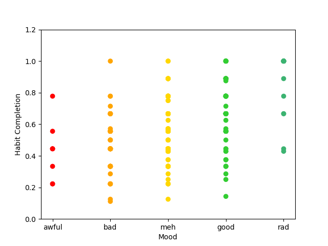
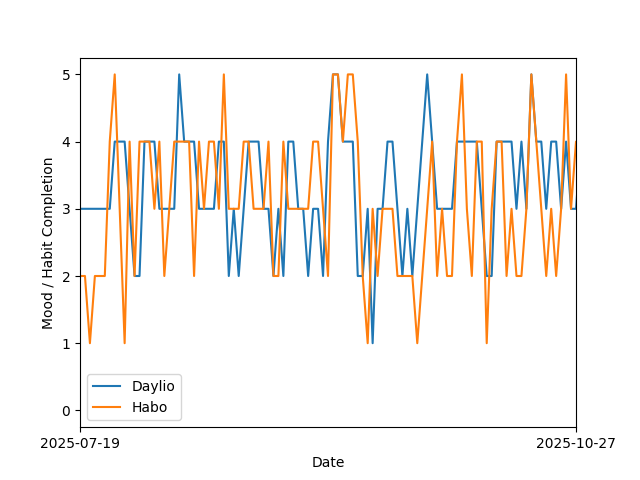

# Daylio and Habo Stats

Generate plots and statistics from [Daylio](https://daylio.net/) and [Habo](https://habo.space/) export files.

### Instructions

Put Daylio and Habo export files in this directory named daylio.csv and habo.json.

`daylio.py` and `habo.py` are general use scripts containing helpful functions for working with the output files.

`line.py` generates a line graph of Habo habit completion (%) and Daylio mood over time with a rolling average. The `--habo` or `--daylio` options can optionally be used (after optional date arguments) to only display the Habo completion plot or the Daylio  plot.
Example: `python3 line.py 2024-01-01 2024-12-31 --daylio`.

`scatter.py` generates a scatter plot of Habo habit completion (%) vs Daylio mood

`habit_effects.py` generates statistics of the effects of each Habo habit on Daylio mood as well as a bar graph

> [!NOTE]
> The format of Habo's output .json changed sometime in August / September 2025 in version 3.0.0/3.0.1. The current version supports the latest format. To analyze older Habo exports, use the programs as they were following the first commit: [here](https://github.com/JasonEl1/daylio-habo-stats/tree/42e3ff53c4eb8da3e83bdf5e5a14b27114ef889f)

### Samples

Scatter Plot

Line Plot

Habit Effect Plot

*(habit numbers guide also output by program)
